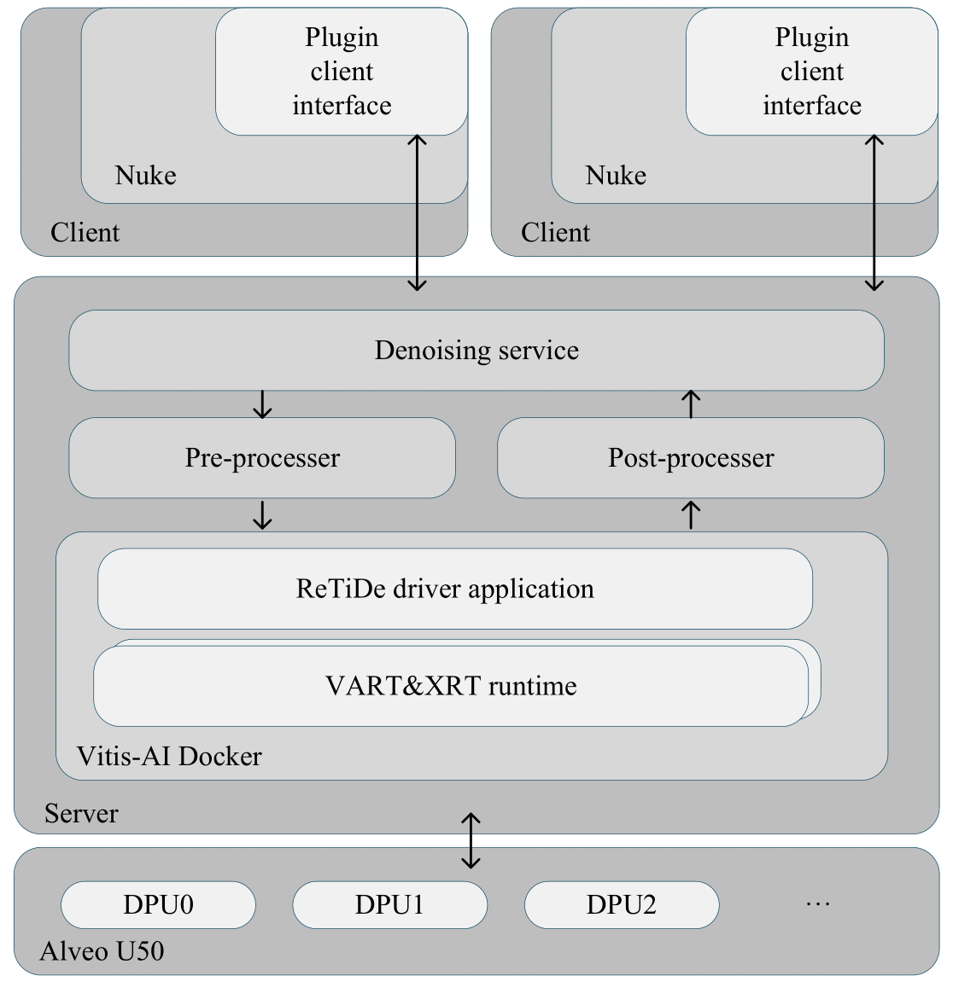

# ReTiDe-Real-Time-Denoising-for-Energy-Efficient-Motion-Picture-Processing-with-FPGAs

Changhong Li, Clement Bled, Rosa Fernandez, Shreejith Shanker.

Conference Homepage: [CVMP 2025
](https://www.cvmp-conference.org/2025/)


## Abstract

Denoising is a core operation in modern video pipelines. In codecs, in-loop filters suppress sensor noise and quantisation artefacts to improve rate-distortion performance; in cinema post-production, denoisers are used for restoration, grain management, and plate clean-up. However, state-of-the-art deep denoisers are computationally intensive and, at scale, are typically deployed on GPUs, incurring high power and cost for real-time, high-resolution streams. ReTiDe (Real-Time Denoise) is a hardware-accelerated denoising system that serves inference on data-centre Field Programmable Gate Arrays (FPGAs). A compact convolutional model is quantised (post-training quantisation plus quantisation-aware fine-tuning) to INT8 and compiled for AMD Deep Learning Processor Unit (DPU)-based FPGAs. A client-server integration offloads computation from the host CPU/GPU to a networked FPGA service, while remaining callable from existing workflows, e.g., NUKE, without disrupting artist tooling. On representative benchmarks, ReTiDe delivers 37.71× Giga Operations Per Second (GOPS) throughput and 5.29× higher energy efficiency than prior FPGA denoising accelerators, with negligible degradation in Peak Signal-to-Noise Ratio (PSNR) and Structural Similarity Index (SSIM). These results indicate that specialised accelerators can provide practical, scalable denoising for both encoding pipelines and post-production, reducing energy per frame without sacrificing quality or workflow compatibility.

## Dataset
The datasets we used for benchmarking are listed as follows: 
- BSD68: https://www.kaggle.com/code/mpwolke/berkeley-segmentation-dataset-68
- BSD68C: https://github.com/clausmichele/CBSD68-dataset?tab=readme-ov-file
- BSD100: https://www.kaggle.com/datasets/asilva1691/bsd100
- SET12: https://www.kaggle.com/datasets/leweihua/set12-231008

## Result
We benchmarked our model with both color and grayscale datasets and the results can be found as follows.
### PSNR (dB) Comparison of Various Algorithms for Grayscale Image Denoising

| Type    | Method        | BSD68 15 | BSD68 25 | BSD68 50 | URBAN100 15 | URBAN100 25 | URBAN100 50 |
|---------|---------------|----------|----------|----------|-------------|-------------|-------------|
| **FP32** | BM3D         | 30.95    | 25.32    | 24.89    | 31.91       | 29.06       | 24.45       |
|         | FFDNet       | 31.45    | 28.96    | 25.16    | 33.76       | 31.41       | 28.09       |
|         | IRCNN        | 31.46    | 28.79    | 25.11    | 33.08       | 29.62       | 24.53       |
|         | DnCNN-20     | 31.60    | 29.14    | 26.20    | 33.76       | 30.19       | 19.34       |
|         | SwinIR       | 31.76    | 29.10    | 25.40    | 33.44       | 30.43       | 25.47       |
|         | **ReTiDe**   | 31.48    | 29.09    | 26.20    | 33.25       | 30.60       | 26.55       |
| **QNNs** | L-DnCNN      | 31.44    | 29.01    | 26.08    | -           | -           | -           |
|         | **ReTiDe (P)** | 29.92  | 28.35    | 26.73    | 29.92       | 28.35       | 25.52       |
|         | **ReTiDe (Q)** | 30.94  | 29.23    | 26.73    | 30.20       | 28.46       | 25.61       |

### PSNR (dB) and SSIM Comparison of Popular Denoisers for Colour Denoising on BSD100

| Type    | Method        | Blind/Nonblind | 5 PSNR | 5 SSIM | 15 PSNR | 15 SSIM | 25 PSNR | 25 SSIM | 35 PSNR | 35 SSIM | 45 PSNR | 45 SSIM |
|---------|---------------|----------------|--------|--------|---------|---------|---------|---------|---------|---------|---------|---------|
| **FP32** | BM3D         | Nonblind       | 39.85  | 0.98   | 33.17   | 0.9223  | 30.16   | 0.8598  | 28.17   | 0.8007  | 26.62   | 0.7470  |
|         | DnCNN        | Blind          | 39.72  | 0.9728 | 33.46   | 0.9245  | 30.56   | 0.8711  | 28.62   | 0.8217  | 27.11   | 0.7766  |
|         | FFDNet       | Nonblind       | 39.84  | 0.9788 | 33.65   | 0.9265  | 31.00   | 0.8772  | 29.37   | 0.8337  | 28.23   | 0.7958  |
|         | IRCNN        | Nonblind       | 39.95  | 0.9789 | 33.41   | 0.9234  | 30.45   | 0.8678  | 28.43   | 0.8114  | 26.87   | 0.7578  |
|         | **ReTiDe**   | Blind          | 39.46  | 0.9761 | 33.27   | 0.9205  | 30.65   | 0.8682  | 29.03   | 0.8224  | 27.89   | 0.7826  |
| **QNNs** | **ReTiDe (P)** | Blind        | 32.94  | 0.8943 | 30.38   | 0.8414  | 28.95   | 0.8149  | 27.96   | 0.7941  | 27.06   | 0.7713  |
|         | **ReTiDe (Q)** | Blind        | 33.22  | 0.9425 | 31.03   | 0.9008  | 29.37   | 0.8576  | 28.14   | 0.8164  | 27.14   | 0.7811  |



### Performance Comparison Across Platforms: Frequency, Throughput, Power, and Energy Efficiency

| Method      | Platform          | Thr. (GOPS) | Power (W) | Energy Eff. (GOPS/W) |
|------------|-----------------|-------------|-----------|---------------------|
| L-DnCNN    | I7-7700HQ CPU   | 29.5        | 45        | 0.66                |
| TNet-mini  | I5-12400F CPU   | 164.3       | 65        | 2.53                |
| ReTiDe     | U7-265K CPU     | 770.2       | 42.1      | 18.30               |
| L-DnCNN    | RTX 1070 GPU    | 1066.7      | 115       | 9.28                |
| TNet-mini  | RTX 2080Ti GPU  | 1785.7      | 250       | 7.14                |
| ReTiDe     | A4000 GPU       | 8,285.5     | 236.3     | 35.06               |
| L-DnCNN    | MZU03A-EG FPGA  | 41.8        | 2.4       | 17.18               |
| TNet-mini  | MZU03A-EG FPGA  | 99.3        | 2.6       | 38.51               |
| **ReTiDe** | Alveo U50 FPGA  | 3,746.1     | 18.4      | 203.59              |


## Citation
- If you found this work is useful for you, please cite our work below.
``` bib
@article{li2025retide,
  title={ReTiDe: Real-Time Denoising for Energy-Efficient Motion Picture Processing with FPGAs},
  author={Li, Changhong and Bled, Cl{\'e}ment and Fernandez, Rosa and Shanker, Shreejith},
  journal={arXiv preprint arXiv:2510.03812},
  year={2025}
}
```

## Demo
- A demo video could be found at: https://www.youtube.com/watch?v=0epcrRA_f2w

## Acknowledgement
This work was funded by the Horizon CL4 2022 - EU Project Emerald – 101119800.